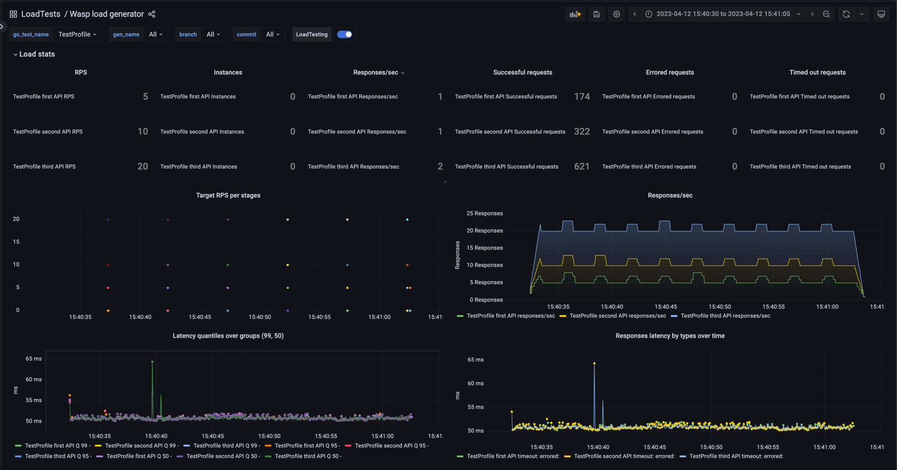

# Wasp

[](https://github.com/smartcontractkit/wasp/actions/workflows/test.yml)

A simple protocol-agnostic load testing tool for `Go`

### Goals
- Easy to reuse any custom client `Go` code
- Easy to grasp
- Have slim codebase (500-1k loc)
- Have predictable performance footprint when tested with protocol mocks
- Be able to perform synthetic load testing for request-based protocols in `Go` with `RPS bound load` (http, etc.)
- Be able to perform synthetic load testing for streaming protocols in `Go` with `Instances bound load` (ws, etc.)
- Scalable in `k8s` without complicated configuration or vendored UI interfaces
- Non-opinionated reporting, push any data to `Loki`
## Setup
```bash
make install_deps
```

## Run example tests with Grafana + Loki
```bash
make start
```
Insert `GRAFANA_TOKEN` created in previous command
```bash
export LOKI_URL=http://localhost:3030/loki/api/v1/push
export GRAFANA_URL=http://localhost:3000
export GRAFANA_TOKEN=...
export DATA_SOURCE_NAME=Loki
export DASHBOARD_FOLDER=LoadTests
export WASP_LOG_LEVEL=info
make dashboard
```
Run some tests:
```
make test_loki
```
Open your [Grafana dashboard](http://localhost:3000/d/wasp/wasp-load-generator?orgId=1&refresh=5s)

Basic [dashboard](dashboard/dashboard.go):


Remove environment:
```bash
make stop
```

## Run pyroscope test
```
make pyro_start
make test_pyro
make pyro_stop
```
Open [pyroscope](http://localhost:4040/)

You can also use `trace.out` in the root folder with `Go` default tracing UI

## Tutorial
Check [tutorial](./TUTORIAL.md) for more examples